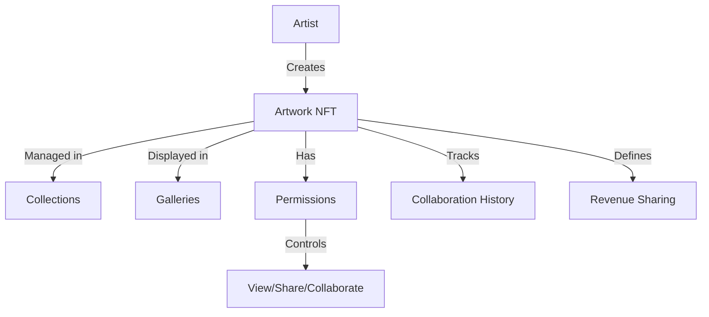

# PixelVault Digital Art Platform

A decentralized platform for digital artists to securely store, collaborate, and showcase their artwork using NFTs on the Stacks blockchain.

## Overview

PixelVault enables digital artists to:
- Create and manage digital artworks as NFTs
- Collaborate with other artists through customizable permissions
- Set up revenue-sharing arrangements for collaborative works
- Organize artworks into collections and virtual galleries
- Maintain verifiable history of contributions and modifications

## Architecture

The platform is built around a core smart contract that manages digital artworks as NFTs with extensive collaboration and permission features.



### Core Components
- **Artworks**: NFTs with metadata, content hash, and ownership information
- **Permissions**: Granular access control for viewing, sharing, and collaboration
- **Collaboration History**: Versioned tracking of contributions
- **Revenue Sharing**: Configurable profit distribution for collaborative works
- **Collections**: Curated groups of artworks
- **Galleries**: Virtual exhibition spaces

## Contract Documentation

### pixel-vault.clar

The main contract handling all platform functionality.

#### Key Data Structures
- `artworks`: Core artwork metadata and ownership
- `artwork-permissions`: Access control settings
- `collaboration-history`: Contribution tracking
- `revenue-sharing`: Profit distribution rules
- `collections`: Artwork groupings
- `galleries`: Exhibition spaces

#### Permission Levels
```clarity
PERMISSION-NONE       (u0)
PERMISSION-VIEW       (u1)
PERMISSION-SHARE      (u2)
PERMISSION-COLLABORATE (u3)
```

## Getting Started

### Prerequisites
- Clarinet
- Stacks wallet
- Node.js environment

### Basic Usage

1. Create a new artwork:
```clarity
(contract-call? .pixel-vault create-artwork 
    "My Artwork" 
    "Description" 
    0x... ;; content-hash
    false ;; is-collaborative
)
```

2. Set permissions:
```clarity
(contract-call? .pixel-vault set-permission 
    artwork-id 
    collaborator-address 
    PERMISSION-COLLABORATE
)
```

3. Create a gallery:
```clarity
(contract-call? .pixel-vault create-gallery 
    "My Gallery" 
    "Gallery Description" 
    true ;; is-public
)
```

## Function Reference

### Artwork Management

#### create-artwork
```clarity
(create-artwork title description content-hash is-collaborative)
```
Creates a new artwork NFT.

#### update-artwork-metadata
```clarity
(update-artwork-metadata artwork-id title description)
```
Updates artwork metadata.

#### update-artwork-content
```clarity
(update-artwork-content artwork-id content-hash contribution-description)
```
Updates artwork content with contribution tracking.

### Collaboration

#### set-permission
```clarity
(set-permission artwork-id user permission-level)
```
Sets user access permissions for an artwork.

#### set-revenue-sharing
```clarity
(set-revenue-sharing artwork-id shares)
```
Configures revenue distribution for collaborative works.

### Gallery Management

#### create-gallery
```clarity
(create-gallery name description is-public)
```
Creates a new virtual gallery.

#### add-to-gallery
```clarity
(add-to-gallery gallery-id artwork-id display-order)
```
Adds artwork to a gallery with specified display order.

## Development

### Testing
1. Install Clarinet
2. Run tests:
```bash
clarinet test
```

### Local Development
1. Start Clarinet console:
```bash
clarinet console
```
2. Deploy contracts:
```clarity
(contract-call? .pixel-vault ...)
```

## Security Considerations

### Access Control
- Only artwork owners can modify core metadata
- Permissions are enforced for all collaboration actions
- Revenue sharing must total 100% for valid configuration

### Known Limitations
- Content storage is off-chain with hash verification
- Revenue sharing limited to 10 contributors per artwork
- Collaboration history tracks only direct contributions

### Best Practices
- Verify permissions before attempting modifications
- Check artwork existence before operations
- Validate all revenue sharing configurations
- Use appropriate permission levels for different collaboration scenarios